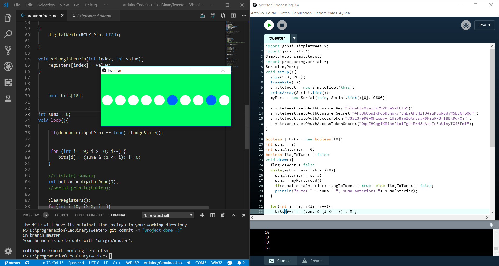
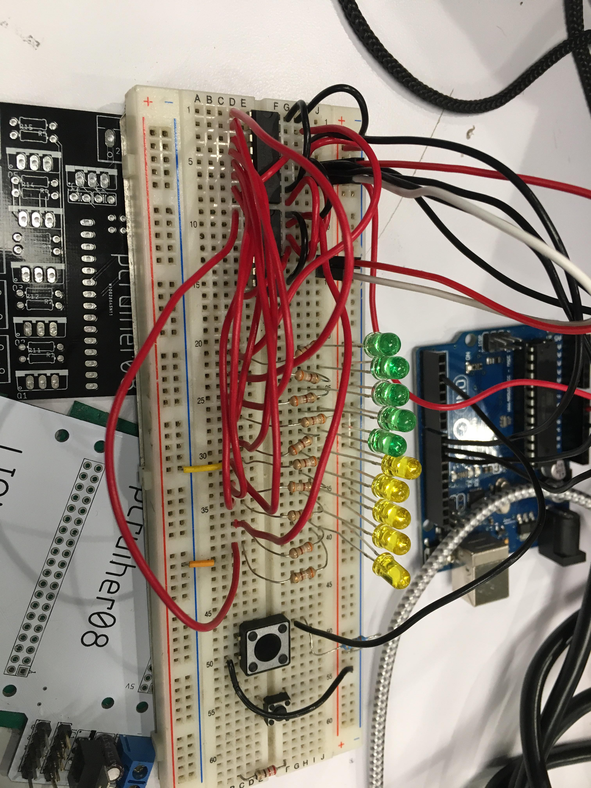
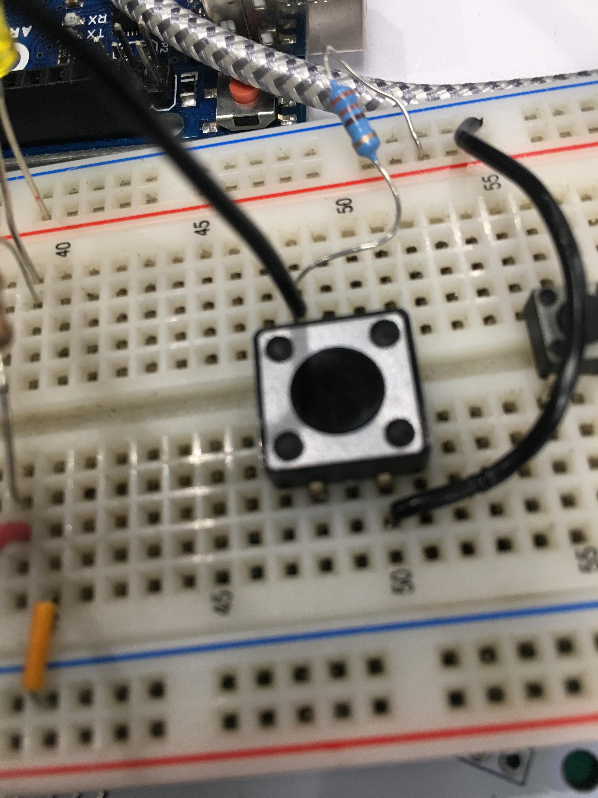
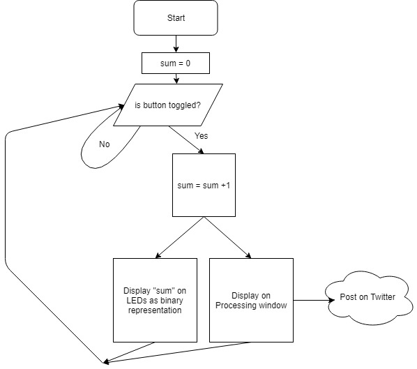
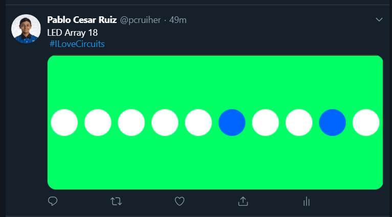
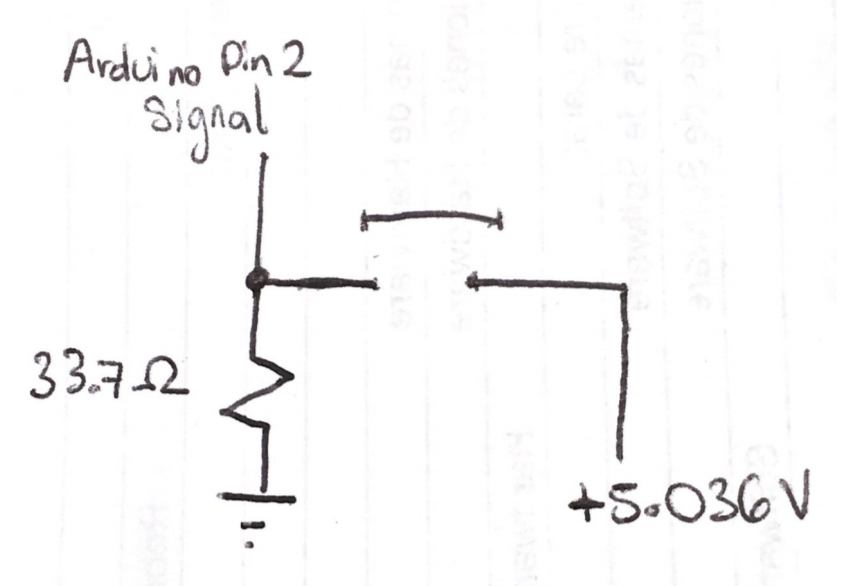
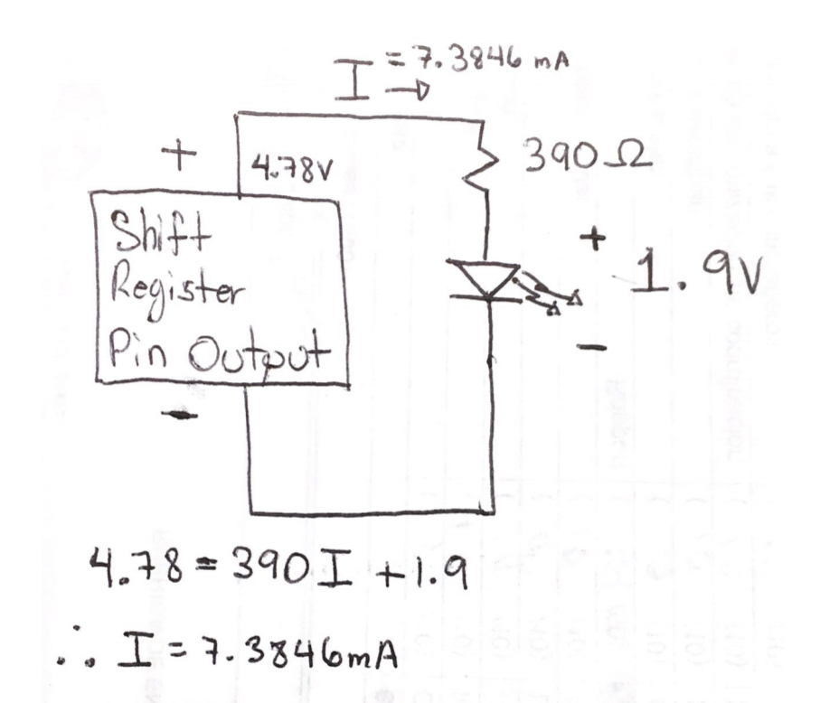

# LedBinaryTweeter
### List of things done with this project
- [x] Arduino code
- [x] Button adding up to a variable every time it's pressed
- [x] Shift Registers writing current number
- [x] Arduino connecting with Processing via a Serial port
- [x] Processing showing a virtual representation of what is shown with the LEDs
- [x] Processing posting a tweet on Twitter
- [x] README.md done

Process
```
Shift registers circuit
Arduino Code and LEDs display
Button adder
Processing Code and LEDs display
Twitter API connection
```

## Code Display


## Circuit


## Button to be pressed


## Flow Diagram


## Tweet Demonstration


## Button Circuit Diagram


## Single LED Circuit


LED Circuit Description
```
The complete circuit contains 10 different Shift Register Outupts, meaning that there's a total current consumption of 73.8490 mA by the LEDs in the circuit. 
```

## Concluding 

I liked this project because it helped me improve my skills joining concept between areas. I mixed electronics with programming which makes me be a better Engineer. I hope that I can keep improving with the help of interesting projects such as this one.